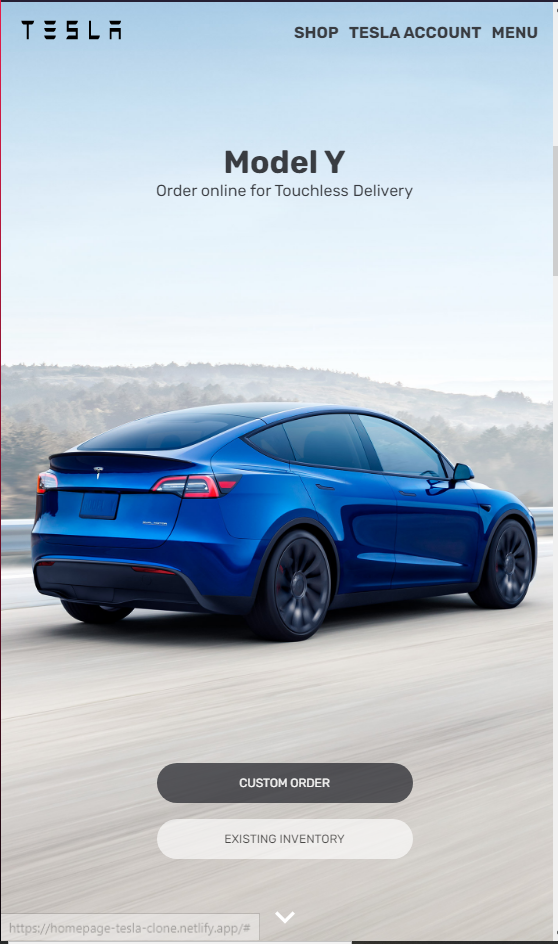

<div id="top"></div>


## Sobre o projeto


<div align="center"><a href="#top">


>Clone da homepage da Tesla. O projeto foi desenvolvido com ReactJs e Styled-components.
</a></div>

<a href="https://homepage-tesla-clone.netlify.app" target="_blank">
    
  </a>

<p align="left">(<a href="https://homepage-tesla-clone.netlify.app">Clique aqui para abrir um demontraçâo</a>)</p>


##🚀 Tecnologias


* ReactJs
* React-Redux
* Redux Toolkit
* Styled-Components
* Material-UI
* React-Reveal


<p align="right">(<a href="#top">back to top</a>)</p>


<


### Como usar

2. Clone o repositorio
   ```sh
   git clone https://github.com/MikaelSantos1/tesla-clone.git
   ```
3. Instale as  depencias
   ```sh
   npm install
   ```
4. Inicie o projeto
   ```js
   npm start
   ```

<p align="right">(<a href="#top">back to top</a>)</p>


